# Cluster Analysis

## Part 1 – Partitioning

### Step 1: Decide Best K

*I- Elbow Plots*

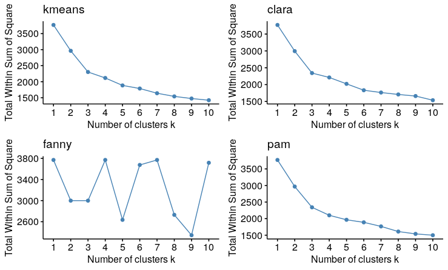

According to these plots we can say the following about the best k for each algorithm:

* k-means → 3
* clara → 3
* fanny → NA
* pam → 3

We can safely say that the fanny algorithm is not suited for our analysis. We drop it from our analysis going forward.

*II- Silhouette*

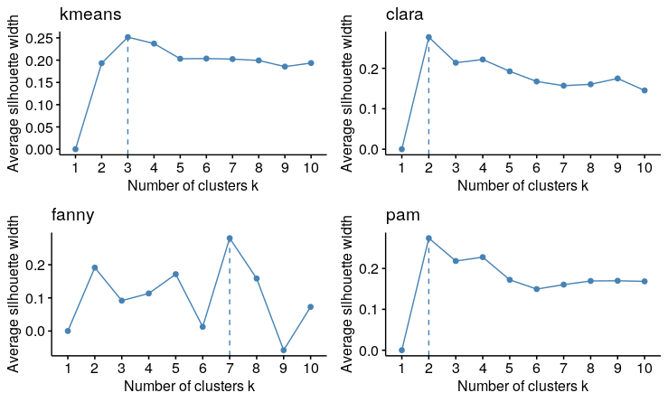

According to these plots we can say the following about the best k for each algorithm:

* k-means → 3
* clara → 2
* pam → 2

*III- Gap Stat*

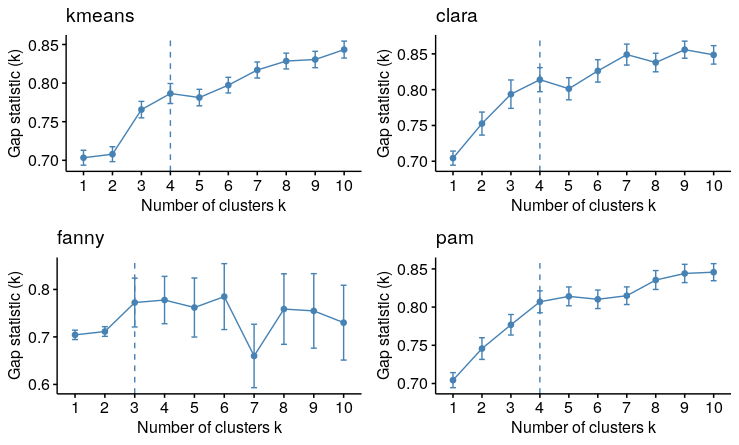

According to these plots we can say the following about the best k for each algorithm:

* k-means → 2
* clara → 3
* pam → 4

According to these figures, we'll try k= 2,3,4

### Step 2: Diagnostics

*I- Using clusplot*

k = 2

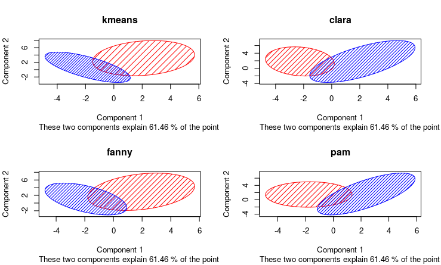

k = 3

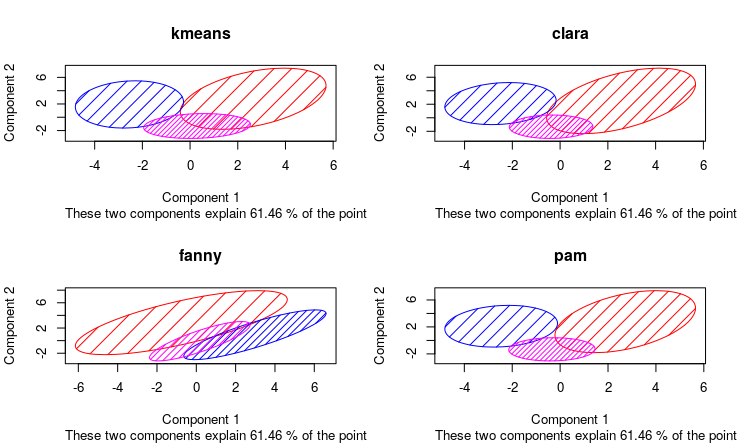

k = 4

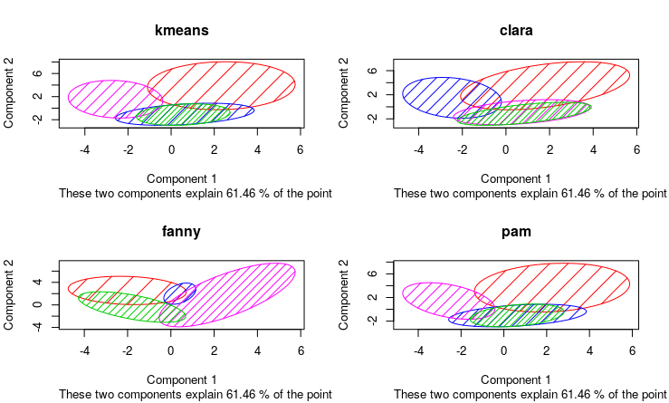

According to these plots, k-means with k=3 is the best clustering algorithm, as it has the least overlap.

*II- Using plotcluster*

k = 2

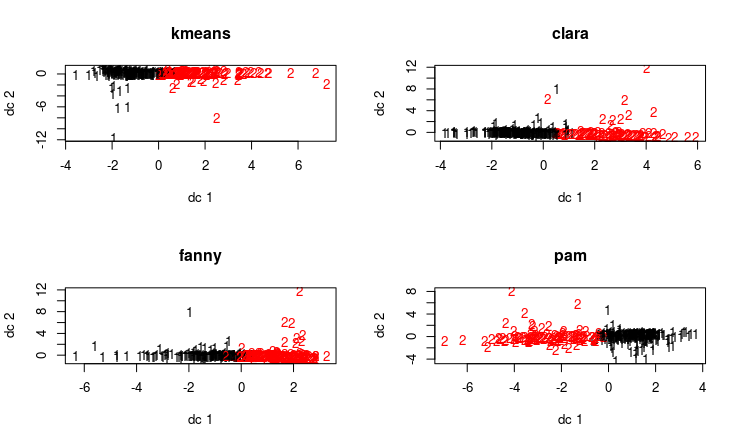

k = 3

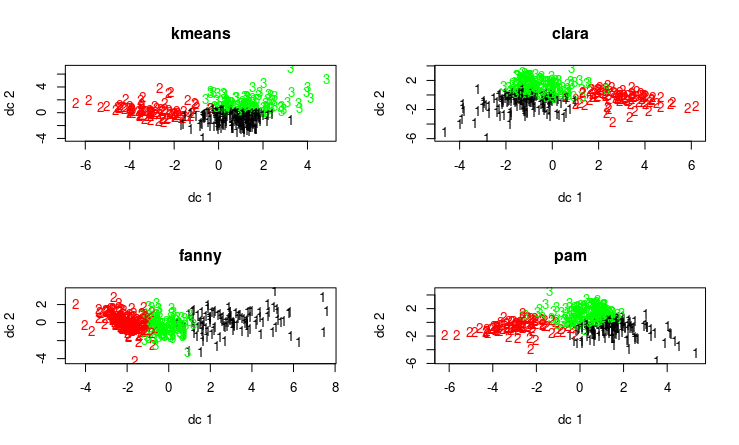

k = 4

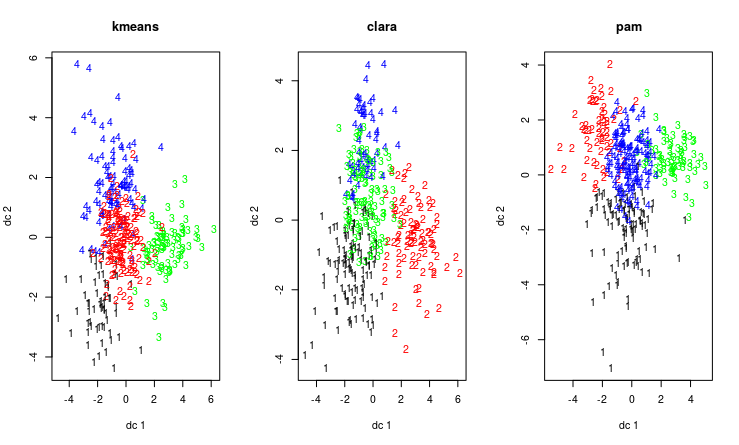

According to these plots, clara with k=3 is the best clustering algorithm, as it has the least amount of outliers.

*III- Using fviz_cluster*

k = 2

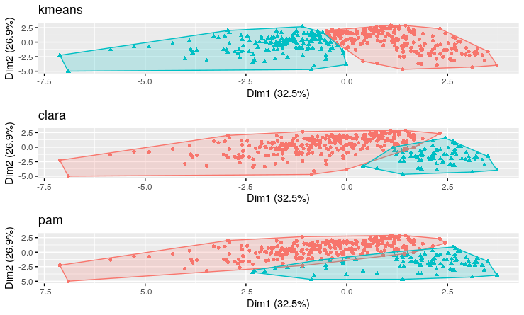

k = 3

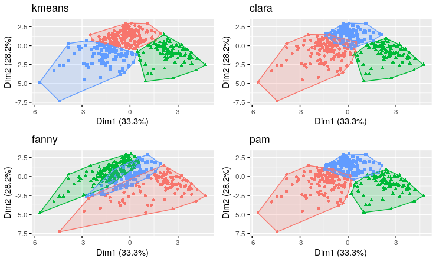

k = 4

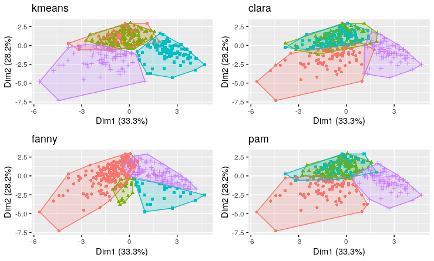

According to these plots, k-means with k=3 is the best clustering algorithm, as it has the least overlap.

**Based on this analysis, we decide that k-means with k=3 is the best algorithm for our dataset.**

## Part 2 – Hierarchical Clusteringi

We will be using the hclust and agnes algorithms in this analysis.

Also, we will be using the complete, average and single methods, as the other methods do not apply to agnes.

Finally, we will be using the canberra, manhattan, euclidean, maximum, and minimum distance metrics.

*I- hclust*

All dendograms

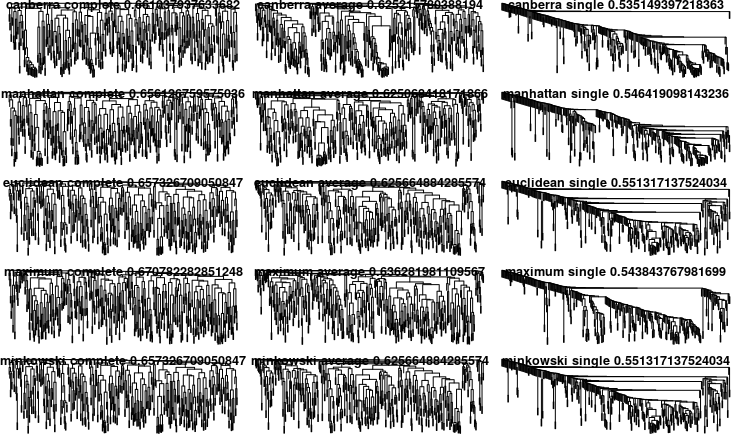

Outlier dendogram

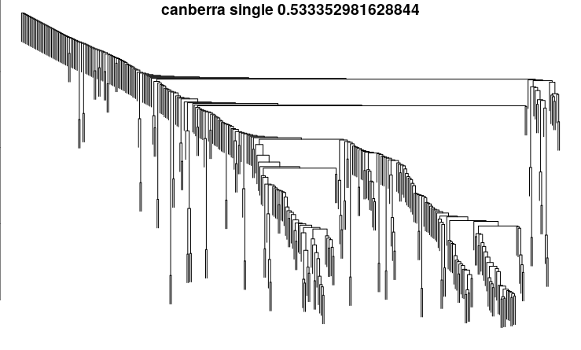

Even dendogram

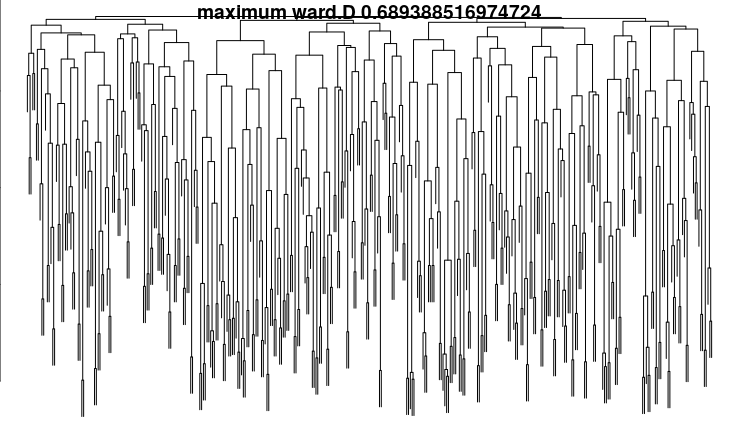

*II- agnes*

All dendograms

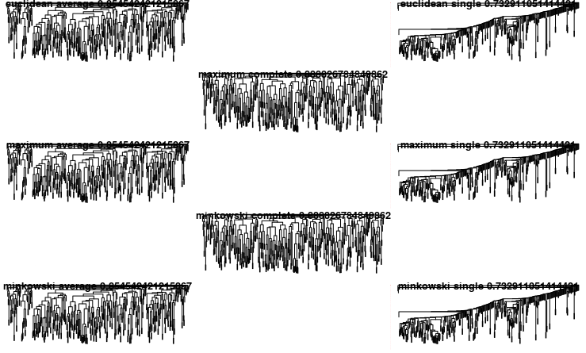

Outlier dendogram

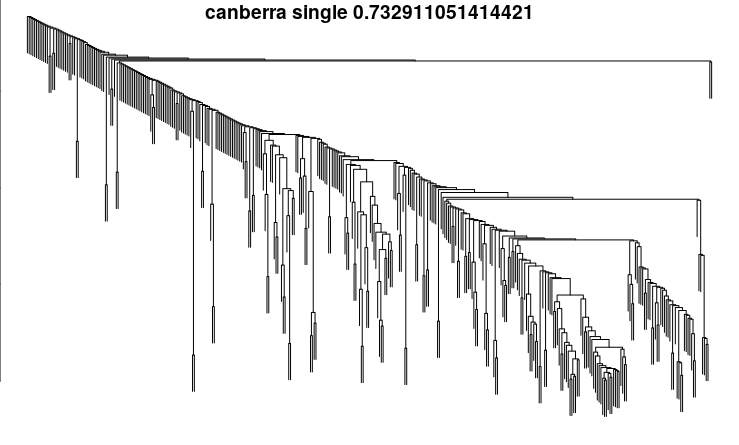

Even dendogram

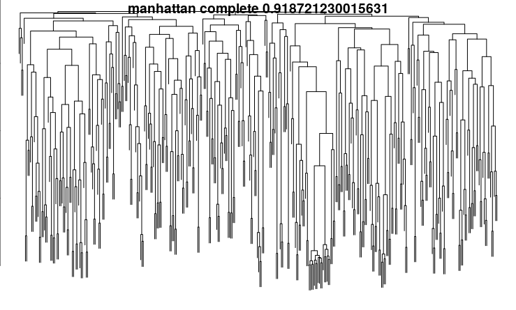

**Based on these plots, we decide that:**

**The best algorithm for outlier detection is: hclust, with canberra distance metric, and using the single method.**

**The best algorithm for even clustring is: agnes, with manhattan distance metric, and using the complete method.**

