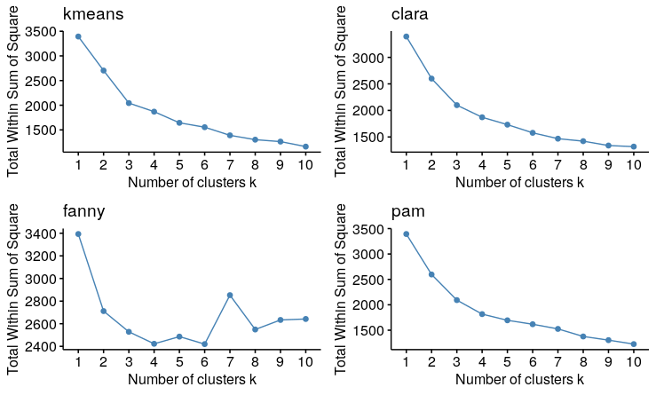
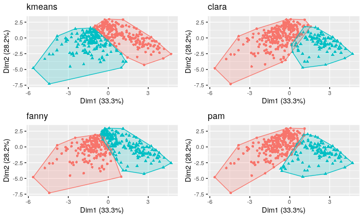
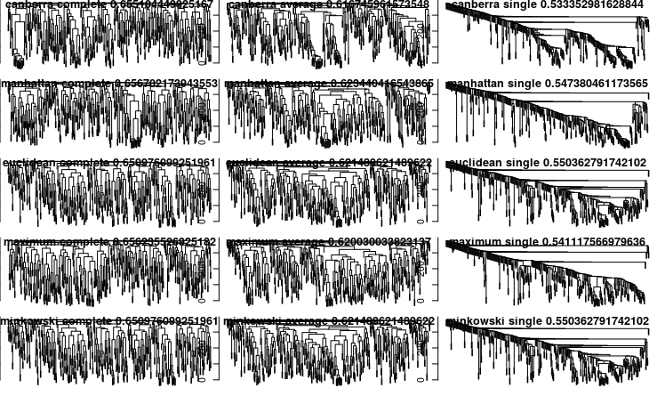
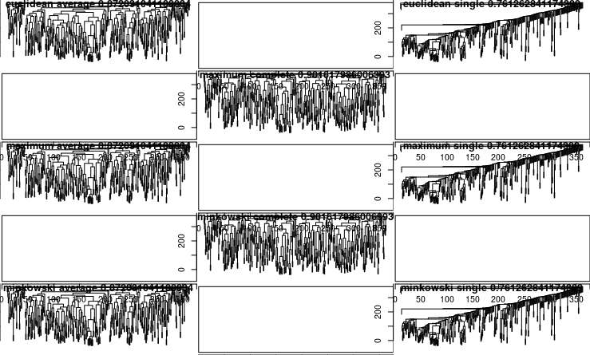
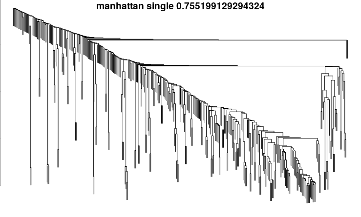

# Cluster Analysis

## Part 1 – Partitioning

In this assignment, we will analyze the shots data for Bundesliga (German soccer league) season 2019/20. We will be using the understatr package to get the data, specifically the get_match_shots(match_id=) function. The function retrieves all the shots in a given match, and it specifies a number of attributes (such as: player who took the shot, the X & Y coordinates of the position where the shot was taken, the body part used to take the shot) for each shot.

We retrieve all the shots of all matches of the seasons, then apply some aggregate functions to have a 'per player' dataset. The final data set looks like this:

The numbers shown in the table are 'per match' averages, except for the 'totalGoalsScored' column. For example, Robert Lewandowski who has scored 25 goals, takes 469 shots per match, with an average expected goal value of 1.02, from an average distance of 12.90 meters, etc.

The final dataset is available in the data/playerShotProfiles19_M.csv file. However, if you can retrieve them using the understatr package by running steps 1 & 2 in main.R, which are currently hashed, just note that this process takes a very long time. 

### Step 1: Decide Best K

*I- Elbow Plots*

According to these plots we can say the following about the best k for each algorithm:

* k-means → 3
* clara → 3
* fanny → 4
* pam → 4

*II- Silhouette*

According to these plots we can say the following about the best k for each algorithm:

* k-means → 3
* clara → 2
* fanny → 7
* pam → 2

*III- Gap Stat*

According to these plots we can say the following about the best k for each algorithm:

* k-means → 4
* clara → 4
* fanny → 3
* pam → 4

According to these figures, we'll try k= 2,3,4,7.

### Step 2: Diagnostics

I- Using clusplot

*k = 2*

*k = 3*

*k = 4*

*k = 7*

According to these plots, we can say that pam with k=3 is the best clustering algorithm, as it has the least overlap.

II- Using plotcluster

*k = 2*

*k = 3*

*k = 4*

*k = 7*

According to these plots, we can say that k-means with k=3 has the least overlap, and clara with k=3 has the least amount of outliers.

III- Using fviz_cluster

*k = 2*

*k = 3*

*k = 4*

*k = 7*

According to these plots, we can say that k-means with k=3 is the best clustering algorithm, as it has the least overlap.

**Based on this analysis, we decide that k-means with k=3 is the best algorithm for our dataset.**

## Part 2 – Hierarchical Clusteringi

We will be using the hclust and agnes algorithms in this analysis.

Also, we will be using the complete, average and single methods, as the other methods do not apply to agnes.

Finally, we will be using the canberra, manhattan, euclidean, maximum, and minimum distance metrics.

I- hclust

*All dendograms*

*Outlier dendogram*

*Even dendogram*

*II- agnes*

*All dendograms*

*Outlier dendogram*

*Even dendogram*

**Based on these plots, we decide that:**

**The best algorithm for outlier detection is: hclust, with canberra distance metric, and using the single method.**

**The best algorithm for even clustring is: agnes, with manhattan distance metric, and using the complete method.**

