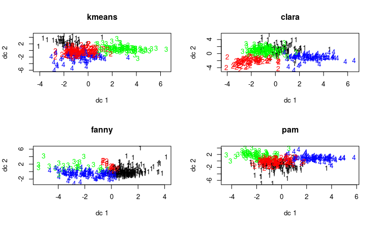

# Cluster Analysis

## Part 1 – Partitioning

Step 1: Decide Best K

I- Elbow Plots

According to these plots we can say the following about the best k for each algorithm:

* k-means → 3
* clara → 3
* fanny → NA
* pam → 3

We can safely say that the fanny algorithm is not suited for our analysis. We drop it from our analysis going forward.

II- Silhouette

According to these plots we can say the following about the best k for each algorithm:

* k-means → 3
* clara → 2
* pam → 2

III- Gap Stat

According to these plots we can say the following about the best k for each algorithm:

* k-means → 2
* clara → 3
* pam → 4

According to these figures, we'll try k= 2,3,4

Step 2: Diagnostics

I- Using clusplot

k = 2

k = 3

k = 4

According to these plots, k-means with k=3 is the best clustering algorithm, as it has the least overlap.

II- Using plotcluster

k = 2

k = 3

k = 4

According to these plots, clara with k=3 is the best clustering algorithm, as it has the least amount of outliers.

III- Using fviz_cluster

k = 2

k = 3

k = 4

According to these plots, k-means with k=3 is the best clustering algorithm, as it has the least overlap.

Based on this analysis, we decide that k-means with k=3 is the best algorithm for our dataset.

